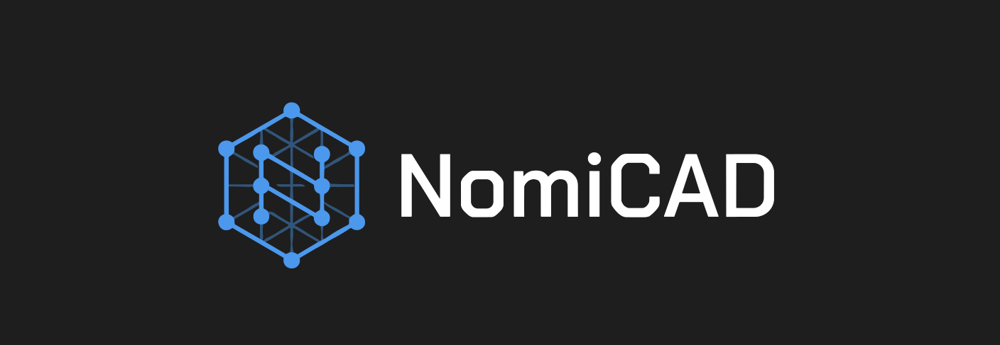

# NomiCAD

A parametric 3D modeling library for personalized tags and keychains, built with TypeScript, Vite, Three.js, and @jscad/modeling.

Model shapes are defined programmatically — change parameters, rebuild the geometry, export to STL. No GUI modeling tool required.


---

## Table of Contents

- [Installation](#installation)
- [Running locally](#running-locally)
- [npm scripts](#npm-scripts)
- [Parameters](#parameters)
- [Architecture](#architecture)
- [Configuration](#configuration)
  - [Config fields](#config-fields)
  - [Default behavior](#default-behavior)
  - [Git workflow](#git-workflow)
  - [CLI reference](#cli-reference)
- [Theming](#theming)
- [Watermark](#watermark)
- [Localization (i18n)](#localization-i18n)
- [STL export](#stl-export)
- [Using as a library](#using-as-a-library)
- [Limitations](#limitations)
- [Extension points](#extension-points)

---

## Installation

```bash
npm install
```

No global installs are required. All tooling runs through `npx` or the local `npm run` scripts.

---

## Running locally

```bash
npm run dev
```

Open `http://localhost:5173` in your browser. The viewer hot-reloads on every file save.

---

## npm scripts

| Script              | Description                                   |
|---------------------|-----------------------------------------------|
| `npm run dev`       | Start Vite development server with HMR        |
| `npm run build`     | Type-check with `tsc`, then bundle with Vite  |
| `npm run preview`   | Serve the production build locally            |
| `npm run typecheck` | Run TypeScript type-checking without emitting |

---

## Parameters

These are the parameters accepted by `buildModel()` and available in the interactive sidebar.

| Parameter           | Type                                                                                              | Default        | Description                                       |
|---------------------|---------------------------------------------------------------------------------------------------|----------------|---------------------------------------------------|
| `shape`             | `"rectangle" \| "rounded-rectangle" \| "oval" \| "circle" \| "triangle" \| "hexagon" \| "star" \| "heart"` | `"rectangle"` | Base shape of the tag |
| `width`             | `number` (mm)                                                                                     | `60`           | Shape width (or diameter when shape is `circle`) |
| `height`            | `number` (mm)                                                                                     | `30`           | Shape height (not used for `circle`)              |
| `thickness`         | `number` (mm)                                                                                     | `3`            | Shape thickness                                   |
| `isKeychain`        | `boolean`                                                                                         | `true`         | Whether to add a keyring hole                     |
| `holeDiameter`      | `number` (mm)                                                                                     | `5`            | Diameter of the keyring hole                      |
| `keychainPosition`  | `"top" \| "bottom" \| "left" \| "right"`                                                        | `"top"`        | Edge where the keyring hole is placed             |
| `keychainPlacement` | `"outside" \| "inside"`                                                                          | `"outside"`    | Whether the hole tab protrudes or sits inside     |
| `text`              | `string`                                                                                          | `"NomiCAD"`    | Text to emboss, engrave, or cut through           |
| `textMode`          | `"positive" \| "negative" \| "cutout"`                                                          | `"negative"`   | How the text is applied to the shape              |
| `textSize`          | `number` (0.3 – 3.0)                                                                             | `1.0`          | Multiplier on the auto-fit font size              |

### Shapes

Shapes are grouped into categories in the sidebar select:

| Category   | Shape                | Notes                                                       |
|------------|----------------------|-------------------------------------------------------------|
| Basic      | `rectangle`          | Sharp corners with a small automatic radius                 |
| Basic      | `rounded-rectangle`  | Same as rectangle but with 25% corner radius — no config needed |
| Basic      | `oval`               | Ellipse scaled to width × height                            |
| Basic      | `circle`             | Perfect circle; only `width` (diameter) applies             |
| Geometric  | `triangle`           | Isosceles triangle, apex at top                             |
| Geometric  | `hexagon`            | Flat-top hexagon scaled to width × height                   |
| Geometric  | `star`               | 5-pointed star; inner radius = 40% of outer                 |
| Decorative | `heart`              | Parametric heart curve scaled to width × height             |

All shapes support text modes (positive, negative, cutout), `textSize` scaling, the keychain hole system, and STL export.

### Font selection

NomiCAD ships 15 built-in font styles, all derived from the Hershey simplex glyph set bundled with JSCAD. Fonts are grouped into three categories in the sidebar dropdown:

#### Classic — weight variants

| Font ID           | UI Label | Stroke weight | Corner style | Best for                         |
|-------------------|----------|---------------|--------------|----------------------------------|
| `simplex`         | Simplex  | 0.07×         | Round        | General use, clean default       |
| `simplex-bold`    | Bold     | 0.13×         | Round        | Small text, high legibility      |
| `simplex-light`   | Light    | 0.04×         | Round        | Delicate, smooth-finish prints   |
| `heavy`           | Heavy    | 0.18×         | Round        | High-contrast, reads at distance |
| `poster`          | Poster   | 0.22×         | Round        | Short display text, large sizes  |

#### Proportions — spacing variants

| Font ID           | UI Label       | Stroke | Spacing | Best for                          |
|-------------------|----------------|--------|---------|-----------------------------------|
| `condensed`       | Condensed      | 0.07×  | 0.72×   | More characters in less width     |
| `extended`        | Extended       | 0.07×  | 1.42×   | Open, airy feel                   |
| `bold-condensed`  | Bold Condensed | 0.12×  | 0.75×   | Bold without wide footprint       |
| `bold-extended`   | Bold Extended  | 0.12×  | 1.38×   | Commanding headline style         |
| `wide`            | Wide           | 0.055× | 1.65×   | Sophisticated spaced-out look     |

#### Style — corner and cap variants

| Font ID           | UI Label  | Stroke | Corner     | Best for                          |
|-------------------|-----------|--------|------------|-----------------------------------|
| `simplex-angular` | Angular   | 0.08×  | Flat/edge  | Technical, engraving look         |
| `stencil`         | Stencil   | 0.10×  | Flat/edge  | Stencil-spray aesthetic           |
| `technical`       | Technical | 0.065× | Flat/edge  | Engineering dataplate style       |
| `engraved`        | Engraved  | 0.05×  | Flat/edge  | CNC engraving, subtle inset text  |
| `rounded`         | Rounded   | 0.09×  | Round ×16  | Friendly, smooth, soft look       |

All 15 styles use the same underlying Hershey simplex glyphs. The visual difference is produced by varying stroke thickness (`strokeScale`), letter spacing (`letterSpacing`), and stroke-end shape (`expandCorners`/`expandSegments`). No font files are converted or loaded at runtime — geometry is generated entirely from the vector data bundled with `@jscad/modeling`.

**Accented character support:** Accented characters render as actual geometry with their diacritical marks intact. The extended font (`accentedFont.ts`) adds glyph entries for code points 192–252 to the base simplex font. JSCAD's character renderer (`vectorChar`) looks up glyphs by code point with no ASCII range guard, so entries for 'ê' (234), 'ã' (227), 'ç' (231), etc. are found and rendered correctly. Each accented glyph is composed from the base letter's strokes plus a diacritical mark (acute, grave, circumflex, tilde, diaeresis, or cedilla) positioned above or below the letter.

Validated examples: "Corrêa" → Corr**ê**a, "João" → Jo**ã**o, "Coração" → Cora**çã**o, "Ação" → A**çã**o, "Informação" → Informa**çã**o.

**Character support:** All printable ASCII (32–126) plus the following accented characters: á à â ã ä / é è ê ë / í ì î ï / ó ò ô õ ö / ú ù û ü / ç and their uppercase equivalents Á À Â Ã Ä / É È Ê Ë / Í Ì Î Ï / Ó Ò Ô Õ Ö / Ú Ù Û Ü / Ç. Characters outside this set fall back to JSCAD's built-in '?' glyph.

**How font selection works:**

1. The user picks a font from the **Text → Font** dropdown (grouped `<select>`).
2. The `fontFamily` parameter is stored in `ModelParams`.
3. `buildText2D()` normalises the input string, looks up the `FontProfile` from `FONT_REGISTRY`, and passes `strokeScale`, `expandCorners`, and `expandSegments` to the path-expansion step.
4. Because all styles rely on JSCAD's default font, no `font` key is passed to `vectorText()` — JSCAD uses its built-in simplex data automatically.

**Adding a new style:** Append an entry to `FONT_REGISTRY` in `src/core/text/fontRegistry.ts`, extend the `FontId` union, add the ID to `FONT_IDS`, add the entry to the dropdown groups in `controls.ts`, and add translation keys for `text.font.<id>` in `en.ts` and `pt-BR.ts`. No other files need to change.

**Adding a genuinely different glyph set:** Provide a Hershey-format data object (same structure as `@jscad/modeling/src/text/fonts/single-line/hershey/simplex.js`) and assign it to `fontData` in the profile. `buildText2D()` will pass it through to `vectorText()` automatically.

### Text sizing

Text rendering uses a two-step sizing model:

1. **Auto-fit base** — `deriveFontSize` computes a base font size proportional to the shape dimensions (`min(height × 0.32, width × 0.1, 9)`). This guarantees sensible default text for any shape size.
2. **User multiplier** — `textSize` scales that base. At `1.0` the text fits naturally; values below `1.0` shrink it, values above `1.0` grow it.

When `textSize > 1.0` causes the text to be larger than the shape's current dimensions, the shape automatically expands to fit — the same auto-expansion that already runs at the default size. Text never escapes the shape boundary.

Valid range: `0.3` – `3.0`. Values outside this range are rejected by the validator. `deriveFontSize` additionally clamps the computed pixel size to a minimum of `0.5 mm` to prevent degenerate geometry at very small multipliers.

---

## Architecture

```
src/
├── main.ts                   # Bootstrap: config → i18n → theme → viewer → controls → watermark
├── app/
│   ├── theme.ts              # applyTheme() — writes CSS custom properties from config
│   ├── viewer/               # Three.js rendering layer (scene, camera, lights, renderer)
│   ├── ui/
│   │   ├── controls.ts       # DOM control builder (grouped select for shapes, all labels via t())
│   │   ├── state.ts          # Reactive state store; seeds modelColor from config.defaultColor
│   │   └── watermark.ts      # createWatermark() — permanent library signature element
│   └── export/               # STL serialization and file download
├── core/
│   ├── parameters/           # Typed parameter interfaces and defaults
│   ├── builders/             # JSCAD geometry builders (rectangleTag, ovalTag, circleTag,
│   │                         #   triangleTag, hexagonTag, starTag, heartTag, keychainTab, …)
│   ├── text/                 # Text mode implementations (positive, negative, cutout)
│   └── model/                # Model orchestration, validation, buildModel entry point
├── config/
│   ├── types.ts              # NomiCADConfig interface and SupportedLanguage union
│   ├── defaults.ts           # Internal fallback values
│   └── loadConfig.ts         # Loads nomicad.config.json via Vite glob; merges with defaults
├── i18n/
│   ├── en.ts                 # English translations (canonical key source)
│   ├── pt-BR.ts              # Portuguese (Brazil) translations
│   └── index.ts              # setLanguage(), t() helper
└── library/
    ├── index.ts              # Public re-exports for library consumers
    ├── shapes.ts             # Convenience wrappers: rectangle(), oval()
    └── presets.ts            # Named parameter presets
bin/
└── nomicad.js                # Node.js CLI (init, config get/set/reset)
```

**Startup sequence:**

```
nomicad.config.json
        │
        ▼
  loadConfig.ts  ──► config.language    ──► setLanguage()
                 ──► config.defaultColor ──► applyTheme()  ──► --accent (CSS var)
                 │                       └► state.modelColor (3D object)
                 └── config.projectName ──► sidebar logo + document.title
```

---

## Configuration

NomiCAD reads project-level settings from a `nomicad.config.json` file at the root of the consuming project. This file is **not** part of the library — each project can have its own.

### Config fields

| Field                    | Type     | Default      | Description                                                                      |
|--------------------------|----------|--------------|----------------------------------------------------------------------------------|
| `language`               | `string` | `"en"`       | UI language. Supported: `"en"`, `"pt-BR"`                                       |
| `defaultColor`           | `string` | `"#4a9eff"`  | Accent color for the UI theme **and** the initial 3D object color (6-digit hex) |
| `units`                  | `string` | `"mm"`       | Dimensional unit label shown in the UI                                           |
| `projectName`            | `string` | `"NomiCAD"`  | Display name shown in the sidebar header and browser tab title                   |
| `sidebarBackgroundColor` | `string` | `"#13132b"`  | Background color of the sidebar panel (6-digit hex)                              |
| `sidebarTextColor`       | `string` | `"#e0e0f0"`  | Primary text color used inside the sidebar (6-digit hex)                         |

Example `nomicad.config.json`:

```json
{
  "language": "pt-BR",
  "defaultColor": "#2e67a9",
  "units": "mm",
  "projectName": "Maker Tags",
  "sidebarBackgroundColor": "#1e1e2f",
  "sidebarTextColor": "#ffffff"
}
```

### Default behavior

`nomicad.config.json` is **optional**. If the file does not exist, the library falls back to internal defaults and works normally — no error, no warning.

Unknown keys are silently ignored. Missing keys are filled from defaults, so a partial config is valid:

```json
{ "language": "pt-BR" }
```

### Git workflow

| File                           | Committed? | Purpose                              |
|--------------------------------|------------|--------------------------------------|
| `nomicad.config.json`          | No         | Project-specific settings; in `.gitignore` |
| `nomicad.config.example.json`  | Yes        | Template to document available fields |

To set up a fresh project:

```bash
npx nomicad init
# Creates nomicad.config.json from the example template
```

### CLI reference

The NomiCAD CLI manages `nomicad.config.json` in the current working directory.

#### `npx nomicad init`

Creates `nomicad.config.json` from the built-in template. Does nothing if the file already exists.

```bash
npx nomicad init
# Created nomicad.config.json
# Edit it to set language ("en" or "pt-BR"), defaultColor, and units.
```

#### `npx nomicad config get`

Prints the current configuration as formatted JSON. If no config file exists, shows the internal defaults.

```bash
npx nomicad config get
# {
#   "language": "en",
#   "defaultColor": "#4a9eff",
#   "units": "mm",
#   "projectName": "NomiCAD"
# }
```

#### `npx nomicad config set <key> <value>`

Sets a single config value. Creates `nomicad.config.json` automatically if it does not exist.

```bash
npx nomicad config set language pt-BR
npx nomicad config set defaultColor "#2e67a9"
npx nomicad config set units mm
npx nomicad config set projectName "Maker Tags"
```

Values are validated before saving. Invalid values exit with code 1:

```bash
npx nomicad config set language de
# Error: Unsupported language "de".
# Supported values: en, pt-BR

npx nomicad config set defaultColor notacolor
# Error: Invalid color "notacolor".
# Expected a 6-digit hex color, e.g. "#2e67a9".
```

#### `npx nomicad config reset`

Restores all config values to their internal defaults and prints the result.

```bash
npx nomicad config reset
# Reset nomicad.config.json to default values.
# {
#   "language": "en",
#   "defaultColor": "#4a9eff",
#   "units": "mm",
#   "projectName": "NomiCAD",
#   "sidebarBackgroundColor": "#13132b",
#   "sidebarTextColor": "#e0e0f0"
# }
```

---

## Theming

At app bootstrap, `applyTheme(config)` writes CSS custom properties onto the document root. Every color in the sidebar comes from one of these variables — nothing is hardcoded. The static values in `:root` act as fallbacks that are active before JavaScript executes.

### Accent color (`defaultColor`)

| CSS variable      | Source                        | Used by                                                        |
|-------------------|-------------------------------|----------------------------------------------------------------|
| `--accent`        | `defaultColor` verbatim       | Logo, active buttons, range/checkbox inputs, Export STL button |
| `--accent-hover`  | `defaultColor` lightened 18%  | Export STL button hover state                                  |
| `--accent-subtle` | `defaultColor` at 7% opacity  | Info box background                                            |
| `--accent-border` | `defaultColor` at 18% opacity | Info box border                                                |

Changing `defaultColor` affects: active segment-control buttons, slider and checkbox highlights, text input focus ring, the Export STL button, the sidebar logo, the info box tint, and the initial 3D object color.

### Sidebar colors

| CSS variable     | Config field             | Fallback    | Used by                                                    |
|------------------|--------------------------|-------------|------------------------------------------------------------|
| `--sidebar-bg`   | `sidebarBackgroundColor` | `#13132b`   | `#sidebar` background                                      |
| `--sidebar-text` | `sidebarTextColor`       | `#e0e0f0`   | Sidebar base text, slider value readouts, text inputs, segment button hover |

`--sidebar-text` is set on `#sidebar` directly and cascades to all child elements that use it. Muted labels continue to use the global `--text-muted` variable.

```bash
npx nomicad config set sidebarBackgroundColor "#1e1e2f"
npx nomicad config set sidebarTextColor "#ffffff"
```

---

## Watermark

A permanent signature is always rendered in the sidebar footer, regardless of `projectName`:

- English: `NomiCAD v0.1.0 — made by Mathaus Huber`
- Portuguese: `NomiCAD v0.1.0 — feito por Mathaus Huber`

The version is injected at build time from `package.json` via `__APP_VERSION__` (Vite `define`). The credit phrase is localized through the active i18n locale. The watermark always references "NomiCAD" as the library brand and cannot be overridden by `projectName`.

---

## Localization (i18n)

All UI text is loaded through a translation system. There are no hardcoded strings in the UI layer.

### Supported languages

| Code    | Language            | Status  |
|---------|---------------------|---------|
| `en`    | English             | Default |
| `pt-BR` | Portuguese (Brazil) | Full    |

### How it works

At startup, `setLanguage(config.language)` is called before any UI is built. Every call to `t('some.key')` returns the translated string for the active locale.

```typescript
import { t } from './i18n'

label.textContent = t('shape.width')  // "Width (mm)" or "Largura (mm)"
```

Translation files live in `src/i18n/`:

- `en.ts` — English (canonical key definition; all other locales must satisfy its shape)
- `pt-BR.ts` — Portuguese (Brazil)

Adding a new language requires:
1. Create `src/i18n/<code>.ts` implementing the `Translations` type
2. Register it in `src/i18n/index.ts`
3. Add it to `SUPPORTED_LANGUAGES` in `bin/nomicad.js`
4. Add it to the `SupportedLanguage` union in `src/config/types.ts`

### Setting the language

```bash
npx nomicad config set language pt-BR
```

The change takes effect on the next page load.

---

## STL export

Click **Export STL** in the sidebar to download the current model as an ASCII STL file.

STL stores geometry only — it does not support color information. The viewer color set via `defaultColor` or the color picker is for visualization purposes only and has no effect on the exported file.

---

## Using as a library

```typescript
import { buildModel, PRESETS } from './src/library'

// Build from a preset with overrides
const geometry = buildModel({
  ...PRESETS.keychainTag,
  text: 'Hello',
  textMode: 'negative',
})

// Build from scratch
const geometry = buildModel({
  shape: 'oval',
  width: 50,
  height: 35,
  thickness: 3,
  isKeychain: true,
  holeDiameter: 5,
  keychainPosition: 'top',
  keychainPlacement: 'outside',
  text: 'World',
  textMode: 'positive',
})
```

### Available presets

| Name           | Shape     | Description                    |
|----------------|-----------|--------------------------------|
| `keychainTag`  | rectangle | Standard tag with keyring hole |
| `miniTag`      | oval      | Small oval tag                 |
| `nameplate`    | rectangle | Wide nameplate, no hole        |
| `pendantOval`  | oval      | Oval pendant, no text          |
| `hexTag`       | hexagon   | Hexagonal tag with keyring     |
| `heartPendant` | heart     | Heart-shaped pendant           |

### Convenience wrappers

```typescript
import { rectangle, oval } from './src/library'

const geo = rectangle({ text: 'Desk', textMode: 'cutout' })
const geo = oval({ width: 45, height: 30 })
```

---

## Limitations

- Text rendering uses JSCAD's built-in Hershey simplex glyph set; custom TTF/OTF fonts are not supported
- All 15 font styles share the same underlying Hershey simplex glyphs — they differ in stroke thickness, letter spacing, and corner style only (no distinct letterforms)
- Accented characters (á, ê, ã, ç, etc.) render as geometry with their diacritical marks composed from vector strokes; marks are approximate Hershey-style lines, not typographic-quality accents
- Characters completely outside the Latin script (Arabic, Chinese, Japanese, etc.) are not supported and fall back to JSCAD's '?' glyph
- Colors are viewer-only — STL files do not carry color data
- Only two languages are currently supported: `en` and `pt-BR`
- Units are always millimeters; unit conversion is not implemented
- The config system uses `import.meta.glob` (Vite-specific); adaptation is needed for other bundlers

---

## Extension points

| Area              | How to extend                                                                                    |
|-------------------|--------------------------------------------------------------------------------------------------|
| New language      | Add `src/i18n/<code>.ts`, register in `index.ts`, add to `SupportedLanguage`                    |
| New config field  | Extend `NomiCADConfig` in `types.ts`, add default in `defaults.ts`                              |
| Theme variables   | Add new CSS custom properties in `applyTheme()` and reference them in the CSS                   |
| New shape         | Add a builder in `src/core/builders/`, add to `Shape` union, wire into `buildModel.ts`, add i18n keys, add to `controls.ts` select groups |
| New shape category| Add a new group object to the `selectRow` call in `controls.ts` and a `shape.category.*` i18n key |
| New font style    | Add an entry to `FONT_REGISTRY` in `fontRegistry.ts`, extend `FontId` union, add i18n keys      |
| New text mode     | Add an implementation in `src/core/text/`, extend `TextMode` union                              |
| New preset        | Add an entry to `src/library/presets.ts`                                                         |
| Units             | Extend `units` config field and pass it through to slider labels via `t()`                      |
